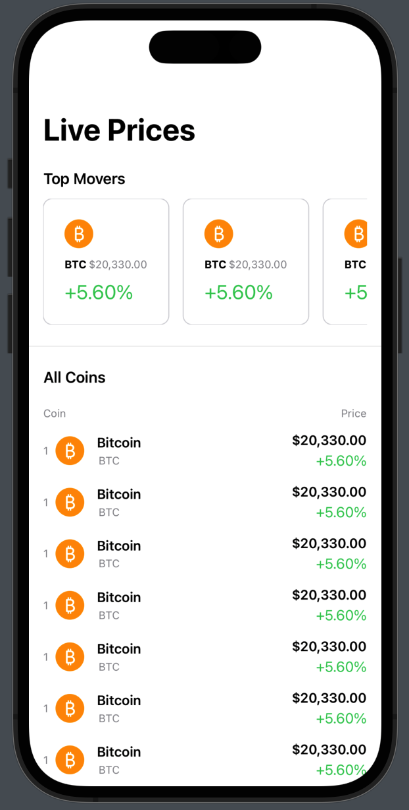

# CryptoTrack

> An iOS application for effortlessly staying updated on the latest cryptocurrency prices.

## Table of Contents

- [Features](#features)
- [Demos](#demos)
- [Technologies](#technologies)
- [Setup](#setup)
- [License](#license)

## Features

1. **Real-Time Price Updates:** Stay up-to-date with real-time cryptocurrency price information.

2. **User-Friendly Interface:** Enjoy a sleek and intuitive design crafted with SwiftUI for a modern user experience.

3. **Dark Mode Support:** Choose between light and dark themes for comfortable day and night use.

4. **Secure and Reliable:** Prioritize security with the assurance that your data is treated with utmost confidentiality.

## Demos

### Main Home View (Static)



## Technologies

- **Swift:** The primary programming language for iOS app development.

- **SwiftUI:** A modern declarative UI framework for building user interfaces across Apple platforms.

## Setup

To run CryptoTrack locally, follow these steps:

1. Clone the repository:

   ```bash
   git clone https://github.com/sebastian-nunez/crypto-track
   ```

## License

This project is licensed under the [MIT License](LICENSE).
